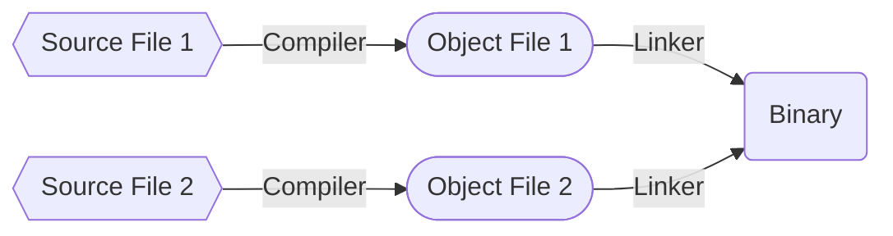

## Introduction

I created this guide because Makefiles have always been a source of confusion and unresolved questions for me during my early years of programming. Even when I tried to learn from internet resources, nothing seemed to make sense. To put an end to this, I decided to create this guide, incorporating everything I've learned after weeks of study.

Within this guide, I've distilled all the essential knowledge and the most common topics about Makefiles. Each topic features a concise description followed by practical examples that you can execute on your own machine.

Let's tackle this challenging subject together and put an end to the confusion once and for all. Best of luck with your studies, and I hope this guide proves valuable in helping you navigate through it.

---

## A First Look To MakeFiles

**Makefiles** originated in the late 1970s as a solution for ***automating software compilation*** on ***Unix systems***. They were invented by ***Stuart Feldman*** at **Bell Labs**. These files enabled developers to define *rules* and *dependencies*, streamlining the build process and improving *software development efficiency*. Over time, **Makefiles** expanded beyond ***Unix*** and became a crucial tool in software development, ensuring reliable and automated builds. **Today, they remain a cornerstone of modern software engineering practices.**

### Why do MakeFiles Existed?

**Makefiles**, often referred to as *make* or *compilation files*, play a pivotal role in the world of software development. They are essential for automating and simplifying a process that would otherwise be complex and error-prone. 

When designing software programs, they often consist of various components, such as multiple source code files and external libraries. Manually compiling and building these components would be a daunting task prone to human errors. This is where **Makefiles** come into play, automating the compilation process, managing dependencies, and allowing programmers to focus on code development rather than dealing with tedious and error-prone tasks. 


### What alternatives are there to Make?

Popular **C/C++** alternative build systems are [SCons](https://scons.org), [CMake](https://cmake.org), [Bazel](https://bazel.build/?hl=pt-br), and [Ninja](https://ninja-build.org). Some code editors like [Microsoft Visual Studio](https://visualstudio.microsoft.com/pt-br/) have their own built in build tools. For Java, there's [Ant](https://ant.apache.org), [Maven](https://maven.apache.org/what-is-maven.html), and [Gradle](https://gradle.org). Other languages like [Go](https://go.dev), [Rust](https://www.rust-lang.org), and [TypeScript](https://www.typescriptlang.org) have their own build tools.

Interpreted languages like [Python](https://www.python.org), [Ruby](https://www.ruby-lang.org/pt/), and raw [Javascript](https://developer.mozilla.org/en-US/docs/Learn/JavaScript/First_steps/What_is_JavaScript) don't require an analogue to **Makefiles**. The goal of **Makefiles** is to compile whatever files need to be compiled, based on what files have changed. But when files in *interpreted languages* change, nothing needs to get recompiled. When the program runs, the most recent version of the file is used.

#### Native Compilation x Cross Compilation

***Native Compilation*** is used to create applications for the same architecture as your development machine. For example, a ***point-of-sale program*** developed in [Java](https://dev.java/learn/getting-started/) on your **x86 machine**, which will run on another **x86 machine**.

In contrast, with ***Cross-Compilation***, you generate a *binary* for an architecture different from your development machine, as is the case with microcontrollers, embedded [Linux](https://www.linux.org), and mobile applications.

The most famous ***open-source tool*** for this purpose is the [GNU Compiler Collection (GCC)](https://gcc.gnu.org). It handles both native and cross-compilation.

#### GCC: How Does It Works

**GCC** is the key component of a [GNU toolchain](https://www.linux.org/threads/gnu-toolchain-explained.10570/), which, as the name suggests, is a *chain of tools* for development and debugging. In a nutshell, **GCC** will transform your source code into an object file and link these object files together to create a binary.



> *Simplified process of binary generation. Here we omit the generation of assembly files.*


### The Versions and Types of MakeFiles

**Makefiles** come in various versions and types, each designed to cater to specific needs and development environments. The **two primary categories** are:

**GNU Make**  
This is the most common and widely used version of Make. It is the default on many ***Unix-like*** systems and is known for its *powerful* and *flexible* features. **GNU Make** allows you to define complex build rules, manage dependencies, and automate the build process efficiently.

**Non-GNU Makes**  
These are variations of Make that are not based on the **GNU Make** utility. Examples include ***BSD Make*** (used in *FreeBSD* and *macOS*) and ***Microsoft's NMake*** (used in *Visual Studio* environments). These versions often have their *own syntax* and *features*, which may differ from **GNU Make**.

The choice of Makefile version and type depends on the project's requirements, the development environment, and personal preferences. 

### MakeFile Syntax

A **Makefile** consists of a set of rules. A rule generally looks like this:

```makefile
targets: prerequisites
  command
  command
  command
```

- The *targets* are file names, separated by spaces. Typically, there is only one per rule.
- The *commands* are a series of steps typically used to make the target(s).
- The *prerequisites* are also file names, separated by spaces. These files need to exist before the commands for the target are run. These are also called *dependencies*.

> *Note: Makefiles **must** be indented using **TABs** and not spaces.*


### The Essence of Make

```makefile
hello:
  echo "Hello, World"
```

Let's start analyzing the *hello world* example. Here we have:

- One *target* called hello.
- This *target* has one *command*.
- This *target* has no *prerequisites*.

Let's provide a more detailed explanation of each part of the code:

```makefile
hello:
```
This line is called a *target definition*. In a **Makefile**, **targets** represent *tasks* or *actions* that you want to execute. In this case, we're defining a target named *hello*. When you run `make hello`, you're instructing **Make** to execute the commands associated with this **target**.

```makefile
echo "Hello, World"
```
This line is a command associated with the ***hello target***. It's the action that **Make** will perform when you ***run make hello***. The *echo command* is a standard command in *Unix-like operating systems* used to **print text** to the terminal. In this case, it's set to display the text `"Hello, World"`.

So, here's how the code works step by step:

- You create a **Makefile** with a target named ***hello***.
- When you run `make hello` in the terminal, **Make** recognizes the ***hello*** target and proceeds to execute the associated command.
- The associated command, `echo "Hello, World"`, is executed, resulting in `"Hello, World"` being printed to the terminal.

Make sure that you understand this. It's the **crux of Makefiles**, and might take you a few minutes to properly understand. 

#### A Brief Example of How MakeFiles Work

```makefile
blah: blah.o
    cc blah.o -o blah  # Runs third

blah.o: blah.c
    cc -c blah.c -o blah.o  # Runs second

blah.c:
    echo "int main() { return 0; }" > blah.c  # Runs first
```

When you run `make` in the terminal, it will build a program called **blah** in a series of steps:

```makefile
black.c:

This line defines a target named blah.c. It's used to specify that the blah.c file should be generated.
```

```makefile
echo "int main() { return 0; }" > blah.c

This line is the command associated with the blah.c target.
When this target is executed, it runs the echo command to create a simple C source file blah.c with a minimal main function.
```

```makefile
blah.o: blah.c:

This line defines a target named blah.o. It indicates that the blah.o object file depends on the blah.c source file.
```

```makefile
cc -c blah.c -o blah.o

This line is the command associated with the blah.o target.
It compiles the blah.c source file into an object file blah.o using the cc compiler.
```

```makefile
blah: blah.o:

This line defines a target named blah, which depends on the blah.o target.
It specifies the rule to build the final executable blah by linking the blah.o object file.
```

In summary, this is what happens when you run make:

- It checks if *blah.c* exists. If not, it creates *blah.c* with the simple C code.
- It then compiles *blah.c* into *blah.o*.
- Finally, it links *blah.o* to create the *blah* executable.

This is just a simple example of using a Makefile. Take your time to fully understand it before proceeding to future topics.

> *Note: cc It's a command that invokes the C compiler.*  
> *Note: -c This flag tells the compiler to compile the source code into an object file without linking it to create an executable.*


### Make Clean

Clean is often used to remove temporary and build-related files for other targets in a project directory. In the following example, `make clean` is used to remove the build-related files created by the *some_file* target.

```makefile
some_file: 
  (commands)

clean:
  rm -f some_file
```

Note that **clean** is doing two new things here:

- It's a *target* that is not first, and not a *prerequisite*. That means it'll never run unless you explicitly call `make clean`.
- If you happen to have a file named **clean**, this target **won't run**. 

This command ensures a clean and organized project directory, making it easier to maintain and debug your code.

> *Note: `rm -f some_file` is a Unix command that forcefully removes a file named "some_file" without asking for confirmation (-f flag ), even if the file is write-protected or doesn't exist.*

## Targets


---

## Conclusion
